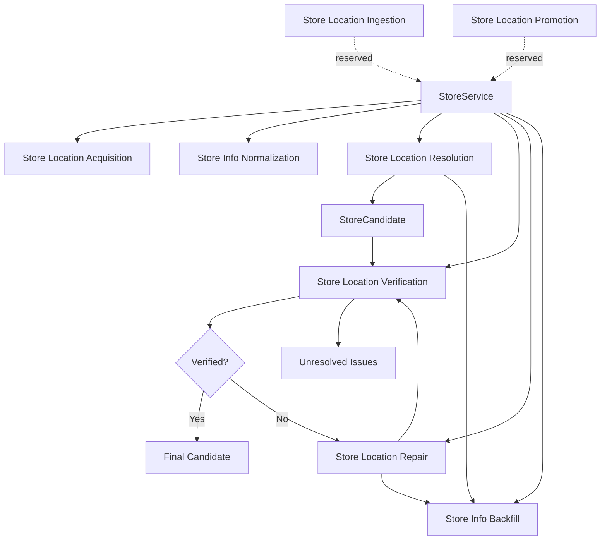
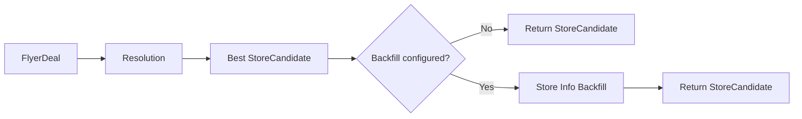
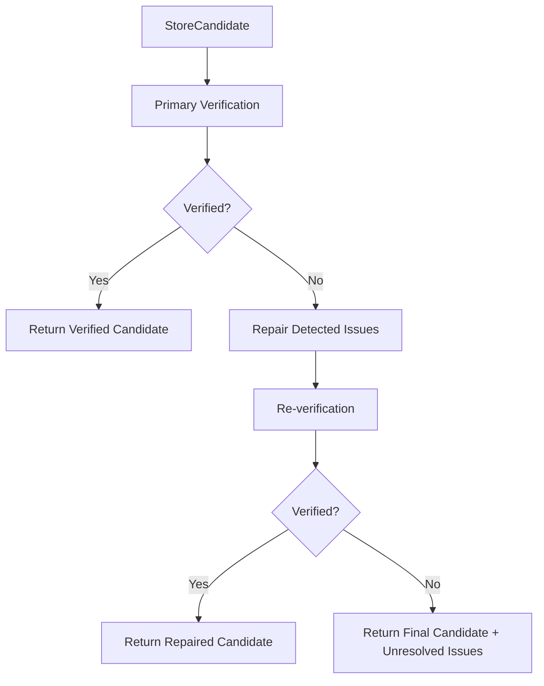

# Store Service

Store Service is the unified facade and orchestration layer for Store Intelligence.

It composes independent store-related capabilities and exposes stable store-oriented interfaces without moving retailer-specific acquisition logic, resolution logic, verification rules, repair strategies, or persistence implementations into the top-level service.

## Architecture



Store Service has two roles:

1. **Capability facade** — expose a stable entry point to an individual capability.
2. **Cross-capability orchestration** — coordinate multiple capabilities to complete a store-related use case.

The underlying capabilities remain independently replaceable and testable.

## Capability Structure

```text
services/store_service/
├── capabilities/
│   ├── store_location_acquisition/
│   ├── store_location_ingestion/        # Demo / reserved for integration
│   ├── store_location_promotion/        # Demo / reserved for integration
│   ├── store_info_normalization/
│   ├── store_location_resolution/
│   ├── store_location_verification/
│   ├── store_location_repair/           # Demo / E2E not fully validated
│   └── store_info_backfill/             # Demo
│
├── geocoders/
├── models/
│   ├── base.py
│   ├── constants.py
│   ├── store_location_issues.py
│   └── workflows.py
│
├── store_service.py
└── __init__.py
```

## Public Interfaces

### Acquisition

```python
store_service.acquire_store_locations(
    retailer,
    strategy_kwargs=None,
)
```

The retailer name is normalized and passed through `StoreLocationAcquisitionStrategyRegistry`, which selects the retailer-specific strategy before the common acquisition workflow runs.

The acquisition capability currently contains retailer-specific strategies for the supported retailers listed in its README. It collects raw artifacts, extracts store payloads, validates the result, and writes timestamped acquisition artifacts.

### Normalization

```python
store_service.normalize_store_location(
    store_location,
)
```

The input is a potentially non-standard `StoreLocationRecord`. The normalization capability owns the adapter from the shared record into its normalization schema, and returns a `StoreInfoNormalizationResult`.

Normalization owns detailed retailer-key and field normalization logic; Store Service exposes only the store-location level interface.

### Resolution

```python
store_service.resolve_store(deal)
store_service.resolve_best_store(deal)
```

Resolution runs its configured internal and external locators, aggregates and deduplicates candidates, then selects the best candidate using its configured selector. Resolution does not perform repair, verification, or persistence.

### Find Store for Deal

```python
store_service.find_store_for_deal(deal)
```

This is the higher-level deal-to-store use case:



Resolution remains responsible for candidate aggregation and selection. Store Service only coordinates the selected candidate with the optional backfill capability. For external candidates, the flyer-deal backfill operator is responsible for creating a canonical store record before the deal references it.

### Verification

```python
store_service.verify_store(candidate)
store_service.verify_store_enhanced(candidate)
```

Primary verification is required but the concrete verifier set is configurable. Secondary verifiers are optional enhancements, including the LLM-backed verifier.

Verification only detects and reports issues. It does not modify the candidate or invoke repair.

### Repair

```python
store_service.repair_store(
    candidate,
    issues,
)
```

Repair consumes issues produced by verification and routes them through configured repair strategies:

```text
DetectedIssue
    ↓
auto repair
    ↓
LLM repair when configured
    ↓
locator fallback when configured
    ↓
StoreRepairResult
```

Repair remains separate from verification and persistence.

### Backfill

```python
store_service.backfill_store_location(store_location)

store_service.backfill_flyer_deal_store(
    deal=deal,
    best_candidate=candidate,
    candidates=candidates,
)
```

Backfill is target-oriented:

- `store_locations` for store information;
- store-related fields in `flyer_deals` for deal backfill.

The current implementation is a demo because the persistence path is not fully integration-tested. External flyer-deal candidates are designed to be canonicalized before the deal is updated.

## Cross-Capability Workflows

### Verify and Repair Store

```python
result = store_service.verify_and_repair_store(
    candidate,
    enhanced_verification=False,
)
```

This is the main verification/repair workflow:



The returned `StoreValidationWorkflowResult` contains:

```text
original_candidate
initial_verification
repair_result
final_candidate
final_verification
unresolved_issues
status
```

The workflow itself does not let Repair decide compliance. Final acceptance is determined by re-verification.

### Backfill After a Successful Workflow

Backfill is available as a separate capability facade and is used by `find_store_for_deal()` when configured.

The current `verify_and_repair_store()` implementation stops after final verification and returns the final candidate or unresolved issues; it does **not** automatically invoke backfill. This keeps persistence separate from the validation workflow and allows callers to decide when persistence should occur.

## Reserved Workflows

The following interfaces are intentionally reserved rather than pretending the current Demo capabilities are production-ready:

```python
store_service.ingest_store_locations(...)
store_service.promote_store_locations(...)
store_service.acquire_ingest_promote_store_locations(...)
```

The intended future pipeline is:


The current ingestion capability is still strategy/demo oriented, with legacy source datasets and retailer-specific transformations.

The current promotion capability is also Demo and currently writes to `store_locations_v2` as a workaround rather than the final production persistence contract.

## Shared Models

The shared models package intentionally contains only cross-capability domain contracts:

| Model | Purpose |
|---|---|
| `StoreCandidate` | Candidate store representation exchanged by resolution, verification, and repair. |
| `StoreLocationRecord` | Shared store-location record used by normalization and persistence-facing flows. |
| `DetectedIssue` | Verification output consumed by repair. |
| `StoreResolution` | Store-to-deal backfill payload. |
| `FlyerDeal` | Minimal deal context used by store workflows. |
| `IssueType` | Shared issue definition and repair-routing metadata. |

Issue definitions and routing metadata are maintained separately in `store_location_issues.py`.

`workflows.py` contains only the workflow result model for verification-and-repair orchestration.

## Geocoding

The shared geocoder provides cached address geocoding with Nominatim as the primary provider and Geoapify as a fallback provider. It is reused by resolution and verification/promotion flows rather than being implemented separately by each capability.

The geocoder does not provide ZIP-centroid fallback for failed address resolution.

## Dependency Boundaries

Store Service intentionally does not absorb the implementation details of each capability.

```text
StoreService
    │
    ├── Acquisition → strategy registry → retailer strategy
    ├── Normalization → canonicalization rules
    ├── Resolution → locators → aggregation → selection
    ├── Verification → configured verifier set
    ├── Repair → issue routing → patch strategies
    └── Backfill → target-specific persistence operators
```

Examples:

- retailer-specific acquisition remains inside acquisition strategies;
- candidate ranking remains inside Resolution;
- verifier composition remains inside Verification;
- issue routing remains inside Repair;
- persistence remains inside Backfill.

This keeps `StoreService` as an orchestration boundary rather than another domain-logic implementation.

## Current Status and Limitations

### Production-ready logic

The core capability boundaries and interfaces are implemented:

- retailer-specific acquisition strategies and registry;
- store-information normalization;
- multi-source store resolution;
- configurable primary and optional secondary verification;
- issue-driven repair strategies;
- target-specific backfill interfaces.

### Demo / incomplete integration paths

The following remain incomplete or not fully validated end to end:

| Capability | Status | Limitation |
|---|---|---|
| Store Location Ingestion | Demo | Current implementation is built around legacy/example inputs and requires retailer-specific strategy integration for newly acquired datasets. |
| Store Location Promotion | Demo | Uses `store_locations_v2` as a workaround while the final `store_locations` persistence path is unresolved. |
| Store Info Backfill | Demo | `store_locations` writeback is not fully validated; flyer-deal persistence methods remain placeholders. |
| Store Location Repair | Demo | Repair logic is implemented, but the full repair → re-verification → persistence flow is not fully integration-tested. |
| Full acquisition → ingestion → promotion | Reserved | Downstream ingestion and promotion paths are not yet production-ready. |

## External Dependencies and Maintenance

Several capabilities depend on external systems and may require maintenance:

- retailer websites, APIs, HTML structures, Next.js data routes, and browser behavior for acquisition;
- Supabase / canonical store lookup infrastructure for internal resolution;
- Nominatim and Geoapify for geocoding and external store evidence;
- OSM/Nominatim availability and rate limits for external verification and locator-backed repair;
- shared `LLMService` tasks for LLM-backed verification and repair.

For retailer acquisition, source changes can invalidate selectors, endpoints, query parameters, browser flows, or build IDs. In particular, the H-E-B Next.js data-route strategy may require a fresh build ID after a site deployment.

## Design Principle

The top-level Store Service should stay small.

It should answer questions such as:

```text
How do I acquire store locations for this retailer?
How do I normalize this store-location record?
Which store best matches this flyer deal?
Is this store candidate valid?
Can these detected issues be repaired?
Where should store-related information be backfilled?
```

It should not contain the retailer-specific scraping implementation, locator-specific matching rules, verifier-specific checks, repair strategy logic, or persistence SQL itself.
