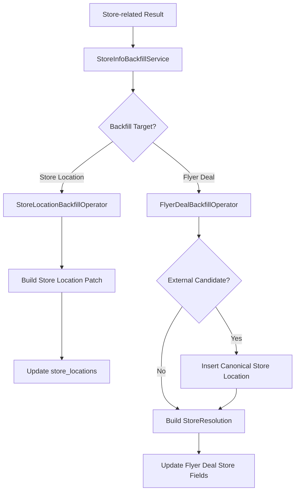
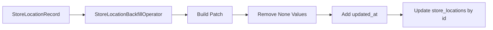
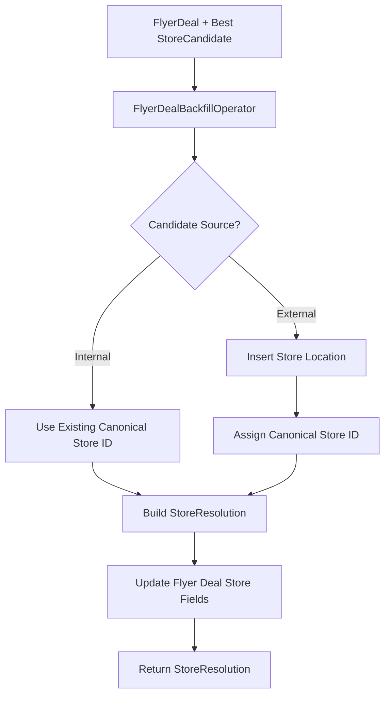
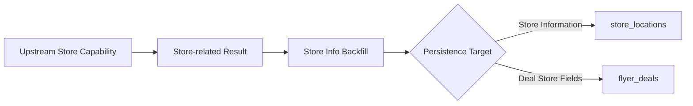

# Store Info Backfill (Demo)

The Store Info Backfill capability provides a unified interface for persisting store-related information after upstream Store Service workflows have produced a resolved, normalized, or repaired result.

Backfill is target-oriented rather than limited to the `store_locations` table. Store information may be written back to a canonical store-location record or to the store-related fields of a flyer deal.

This capability is currently a demo implementation. The persistence paths have not been fully integration-tested because of the current `store_locations` writeback limitation.

## Structure

| Component | Description |
|---|---|
| `store_info_backfill_service.py` | Unified service interface for store-related backfill operations. |
| `protocols.py` | Contracts for target-specific backfill operators. |
| `operators/store_location_backfill_operator.py` | Writes available store information into a canonical store-location row. |
| `operators/flyer_deal_backfill_operator.py` | Builds a `StoreResolution` and writes resolved store information into a flyer deal. |

## Backfill Flow



The service only selects the target-specific operator. Each operator owns the persistence behavior for its target.

## Service Interface

### `StoreInfoBackfillService`

The service currently exposes two public operations.

Backfill a store-location record:

```python
service.backfill_store_location(
    store_location,
)
```

Backfill resolved store information into a flyer deal:

```python
resolution = service.backfill_flyer_deal(
    deal=deal,
    best_candidate=best_candidate,
    candidates=candidates,
)
```

The service delegates both operations to their corresponding operators rather than implementing persistence logic directly.

## Store Location Backfill

`StoreLocationBackfillOperator` accepts a `StoreLocationRecord` and builds an update payload from the available store fields.



Fields with `None` values are omitted from the patch so missing input data does not overwrite existing persisted values.

The current implementation includes fields such as:

- retailer and retailer-specific store ID;
- latitude and longitude;
- address and full address;
- city, state, and ZIP code;
- retailer key;
- geocoding metadata;
- OSM ID;
- source;
- store name;
- map visibility.

The operator currently targets:

```text
store_locations
```

This path is retained as a demo implementation because writeback to `store_locations` is currently unavailable in the active environment.

## Flyer Deal Backfill

`FlyerDealBackfillOperator` backfills the store-related portion of a flyer deal from the selected store candidate.



The generated `StoreResolution` currently includes:

- canonical store ID;
- store latitude and longitude;
- match confidence;
- candidate count;
- candidate store IDs;
- matching source;
- canonical match stage.

For an external candidate, the operator is designed to insert the candidate as a canonical store location before updating the flyer deal.

### Current Demo Limitation

The following persistence methods are intentionally still placeholders:

```python
insert_store_location(...)
update_flyer_deal_store(...)
```

Therefore, the flyer-deal operator currently demonstrates the intended backfill flow and resolution construction, but it is not a complete persistence implementation.

## Protocols

`FlyerDealBackfillOperatorProtocol` defines the flyer-deal backfill contract:

```python
def backfill(
    deal: FlyerDeal,
    best_candidate: StoreCandidate,
    candidates: list[StoreCandidate],
) -> StoreResolution:
    ...
```

`StoreLocationBackfillOperatorProtocol` defines the store-location persistence contract:

```python
def backfill(
    store_location: StoreLocationRecord,
) -> None:
    ...
```

These contracts allow target-specific persistence implementations to be replaced or mocked without changing the conceptual backfill interface.

## Capability Boundary

Store Info Backfill is the persistence-facing capability for store-related information.



Potential upstream producers include Store Location Resolution, Store Info Normalization, and Store Location Repair. Backfill does not perform those operations itself.

The capability is responsible for:

- selecting the appropriate persistence target;
- delegating persistence to a target-specific operator;
- constructing store-resolution data required for flyer-deal backfill;
- updating only store-related information.

It is not responsible for:

- store resolution;
- store verification;
- store repair;
- deciding whether repaired information is compliant;
- general flyer-deal updates unrelated to store information.

## Notes

- **Implementation status:** This capability is currently a demo and has not been fully integration-tested against the persistence layer.
- The current `store_locations` writeback limitation prevents the store-location backfill path from being validated end to end.
- `FlyerDealBackfillOperator.insert_store_location()` and `update_flyer_deal_store()` are currently placeholders, so flyer-deal persistence is also not yet a complete implementation.
- The existing operators preserve the previously implemented backfill behavior and demonstrate the intended target-specific persistence boundaries.
- Store Info Backfill may update both `store_locations` and store-related fields in `flyer_deals`; it is therefore intentionally broader than a store-location-only backfill capability.
- Backfill should only persist store-related fields. Unrelated flyer-deal fields are outside this capability.
