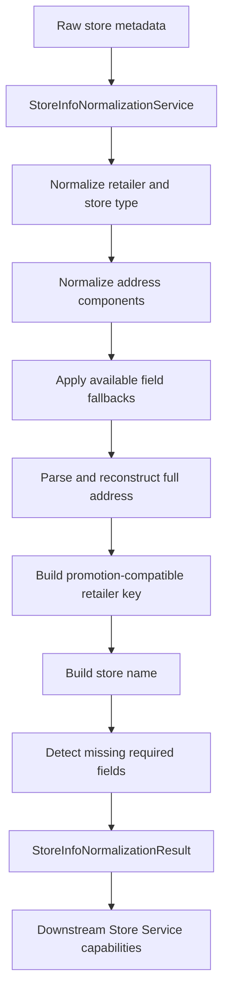
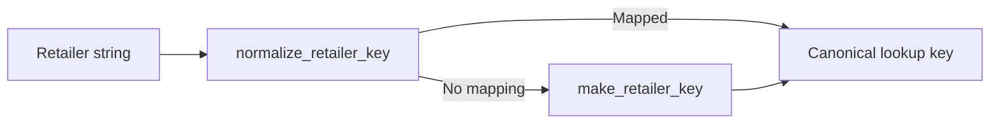
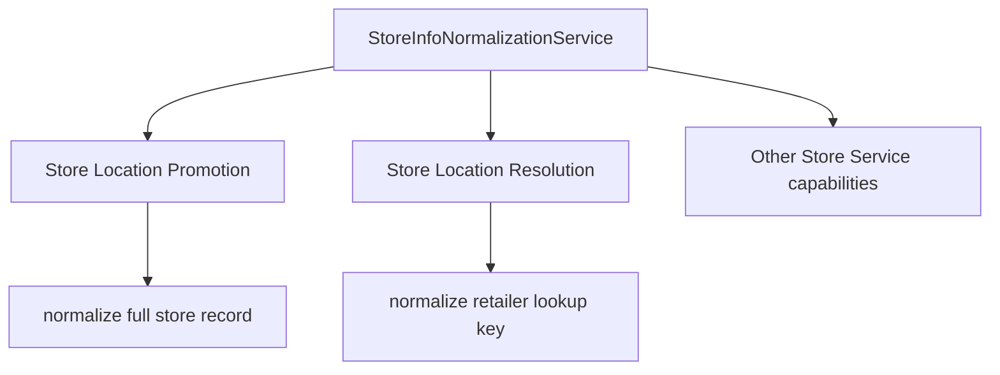

# Store Info Normalization

The Store Info Normalization capability converts raw or partially standardized store metadata into a consistent representation for downstream Store Service workflows.

It centralizes retailer identity normalization, retailer-key generation, store-type normalization, address normalization, ZIP normalization, store-name construction, and basic data-quality issue detection.

## Structure

| Component | Description |
|---|---|
| `constants.py` | Maintains canonical retailer variants and the legacy retailer-key mappings used by Store Service resolution. |
| `store_info_normalization_service.py` | Main normalization service and normalization result model. Provides full-record normalization as well as reusable retailer-key and address normalization helpers. |

## Normalization Flow



The service also exposes the legacy-compatible retailer-key path used by store-location resolution:



## Interfaces

### `StoreInfoNormalizationService`

The main service provides:

| Method | Purpose |
|---|---|
| `normalize()` | Normalizes one complete store-information record. |
| `normalize_many()` | Normalizes multiple records while preserving input order. |
| `normalize_retailer()` | Canonicalizes retailer identity, promotion-compatible retailer key, and store type. |
| `normalize_retailer_key()` | Maps retailer strings to the legacy canonical lookup keys used by Store Service locators. |
| `make_retailer_key()` | Generates a fallback lookup key when no explicit retailer mapping exists. |
| `normalize_address()` | Produces a lightweight normalized address for deduplication and comparison. |

Example:

```python
normalizer = StoreInfoNormalizationService()

result = normalizer.normalize(store_record)

retailer_key = (
    normalizer.normalize_retailer_key(raw_retailer)
    or normalizer.make_retailer_key(raw_retailer)
)
```

### `StoreInfoNormalizationResult`

The normalization result contains:

- canonical retailer and retailer key;
- normalized store type and store number;
- generated store name;
- normalized address, city, state, and ZIP code;
- retained source metadata;
- detected issues;
- normalization notes.

`reason_codes` exposes detected issue names for downstream validation.

The result can also be converted into a canonical store-location payload:

```python
payload = result.to_store_locations_payload(
    source="retailer",
    latitude=latitude,
    longitude=longitude,
)
```

## Retailer Normalization

Two retailer mappings are maintained because they serve different compatibility requirements.

| Mapping | Purpose |
|---|---|
| `DEFAULT_RETAILER_NORMALIZATION_MAP` | Converts known retailer variants into canonical retailer names and may infer store type. |
| `RETAILER_KEY_MAP` | Preserves the historical retailer-key behavior used by Store Service locator lookups. |

For full-record normalization, known variants such as:

```text
walmart supercenter
wal mart
costco wholesale
traderjoes
sams club
```

are converted into canonical retailer representations.

Retailer variants may also infer store type. For example, Walmart variants can identify `Supercenter`, `Neighborhood Market`, `Business Center`, `Fuel Center`, or `Discount`.

Unknown retailers are normalized conservatively rather than rejected.

## Retailer-Key Compatibility

There are currently two retailer-key behaviors in this capability.

### Full-record normalization

`normalize()` and `normalize_retailer()` preserve the existing retailer-key format used by the current normalization/promotion workflow.

### Resolution lookup normalization

`normalize_retailer_key()` and `make_retailer_key()` preserve the historical lookup-key behavior previously provided by `services/address_normalizer.py`.

This distinction is intentional so the older locator lookup contract can be consolidated into this capability without changing the existing Store Location Promotion output.

Store Location Resolution should use:

```python
key = normalizer.normalize_retailer_key(retailer)
if key is None:
    key = normalizer.make_retailer_key(retailer)
```

rather than maintaining its own retailer-key normalization implementation.

## Address Normalization

Full-record normalization standardizes available address components and applies conservative fallbacks when fields are incomplete.

Examples include:

- using `city_slug` when `address_city` is unavailable;
- using `state` when `address_state` is unavailable;
- parsing street, city, state, and ZIP components from `full_address` when possible;
- reconstructing a canonical full address from normalized components;
- reducing ZIP+4 or other ZIP representations to a five-digit ZIP code.

The separate `normalize_address()` helper provides a lighter comparison-oriented representation by lowercasing the address, collapsing whitespace, and removing common suite/unit noise.

## Issue Detection

Normalization identifies missing fields required by downstream workflows.

Current checks include:

- missing retailer;
- missing retailer-specific store ID;
- missing address;
- missing full address;
- missing city;
- missing state;
- missing ZIP code.

Detected issues use the shared Store Service issue definitions when available.

## Downstream Usage



Store Location Promotion consumes the full `StoreInfoNormalizationResult`, while Store Location Resolution primarily uses the legacy-compatible retailer-key methods.

## Notes

- This capability performs deterministic metadata normalization. It does not verify that a store exists or that its normalized address is geographically correct.
- `DEFAULT_RETAILER_NORMALIZATION_MAP` and `RETAILER_KEY_MAP` intentionally serve different normalization contracts and should not be merged without checking downstream compatibility.
- The legacy retailer-key behavior has been moved into this capability so resolution locators no longer need to depend directly on `services/address_normalizer.py`.
- `normalize()` retains its existing retailer-key behavior to minimize impact on Store Location Promotion.
- New retailer aliases may require updates to one or both retailer mappings depending on whether the alias affects canonical metadata normalization, locator lookup compatibility, or both.
- `normalize_address()` is intended for lightweight comparison/deduplication; it is different from the canonical address reconstruction performed by `normalize()`.
- `to_store_locations_payload()` prepares normalized data for downstream canonical store-location workflows but does not perform database writes.
- Store Location Promotion currently depends on the full-record normalization path, while Store Location Resolution depends on the legacy-compatible retailer-key path.
