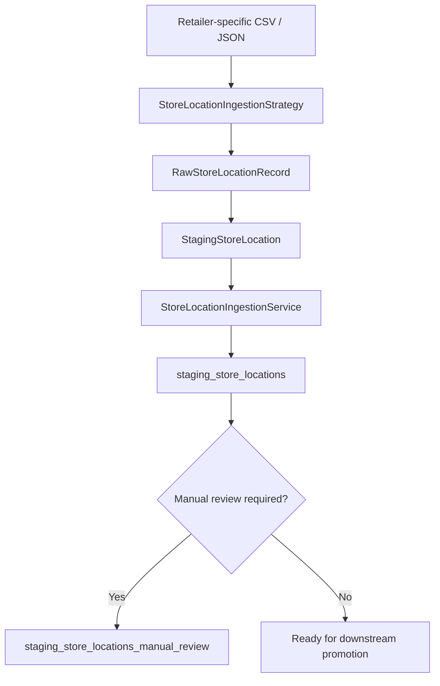

# Store Location Ingestion (Demo) 

The Store Location Ingestion capability provides a structured workflow for converting retailer-specific store-location source data into the common staging format used by Store Service.

It separates retailer-specific input parsing from the shared ingestion workflow through a strategy-based interface.

## Structure

| Component | Description |
|---|---|
| `store_location_ingestion_service.py` | Main ingestion service. Writes staging records into `staging_store_locations`, handles duplicate detection, creates manual-review records when required, and records ingestion results. |
| `protocols.py` | Defines the shared ingestion strategy interface, raw input type, and common `StagingStoreLocation` contract. |
| `strategies/` | Contains retailer/source-specific strategies responsible for converting raw source records into the common staging contract. |
| `strategies/legacy_store_location_ingestion_strategy.py` | Example strategy for the legacy retailer datasets currently included under `input/`. |
| `input/` | Contains source CSV/JSON files used by ingestion strategies. |
| `_output/` | Contains timestamped ingestion results, failures, and summary artifacts. |

## Ingestion Flow



The strategy is responsible for understanding the source-specific schema. The ingestion service only operates on the common `StagingStoreLocation` representation.

## Interfaces

### `StoreLocationIngestionStrategy`

Defined in `protocols.py`.

A strategy provides two main operations:

- `read_raw_records()` — reads retailer-specific source records.
- `to_staging_record()` — converts a raw record into the common `StagingStoreLocation` contract.

### `StoreLocationIngestionService`

The main service accepts a `StoreLocationIngestionStrategy` and provides:

- duplicate detection using retailer and store number;
- insertion into `staging_store_locations`;
- creation of `staging_store_locations_manual_review` records for incomplete data;
- timestamped ingestion result, failure, and summary outputs.

## Adding a Retailer Strategy

Retailers whose source schema differs from the legacy example should implement `StoreLocationIngestionStrategy` from `protocols.py`.

Recommended file naming:

```text
<retailer>_store_location_ingestion_strategy.py
```

Recommended class naming:

```python
<Retailer>StoreLocationIngestionStrategy
```

For example:

```text
walmart_store_location_ingestion_strategy.py
```

```python
class WalmartStoreLocationIngestionStrategy:
    ...
```

The strategy should convert the retailer-specific raw source into `StagingStoreLocation`. The shared ingestion service should not contain retailer-specific field mappings.

## Notes

- **Implementation status:** This capability is currently a demonstration of the strategy-based store-location ingestion workflow rather than a production-ready ingestion pipeline.
- The files currently included under `input/` are legacy/example datasets used to demonstrate the ingestion flow and may be removed or replaced.
- Current retailer acquisition outputs do not share a fully uniform CSV schema, so the included legacy strategy should not be assumed to support newly collected retailer datasets directly.
- Before connecting a new retailer dataset, implement a retailer-specific strategy that conforms to the ingestion protocol and converts the retailer-specific source schema into the shared staging representation.
- The recommended strategy filename is `<retailer>_store_location_ingestion_strategy.py`, with a corresponding class name such as `<Retailer>StoreLocationIngestionStrategy`.
- New retailer input files should preferably use the naming convention `<retailer>_us_locations.csv`.
- CSV is the recommended input format for newly integrated retailer datasets unless a source-specific constraint requires otherwise.
- The ingestion service should remain independent of retailer-specific source schemas; schema-specific parsing and transformation belong inside strategies.