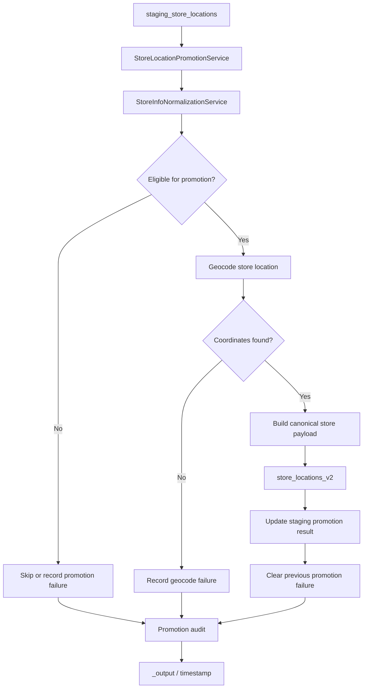

# Store Location Promotion (Demo) 

The Store Location Promotion capability promotes eligible records from the staging store-location table into the canonical store-location table.

It applies the shared Store Service normalization and geocoding workflow, respects manual-review state, records promotion failures, and produces timestamped audit artifacts for each run.

## Structure

| Component | Description |
|---|---|
| `store_location_promotion_service.py` | Main promotion service. Loads staging records, applies promotion gates, normalizes and geocodes eligible records, and inserts successful records into `store_locations_v2`. |
| `constants.py` | Defines promotion table names, output/cache paths, promotion source, and write batch size. |
| `models.py` | Contains `PromotionAuditWriter`, which writes promotion results, failures, and run summaries. |
| `_output/` | Contains timestamped promotion results, failures, and summary artifacts. |

## Promotion Flow



Promotion eligibility includes the existing promotion safeguards: retailer filtering when configured, already-promoted detection, manual-review status, address availability, and normalization validation.

## Interface

### `StoreLocationPromotionService`

The main public interface is:

```python
service = StoreLocationPromotionService()
service.promote()
```

Optional constructor filters can be used for targeted or test runs:

```python
service = StoreLocationPromotionService(
    target_retailer="Walmart",
    test_staging_ids={1, 2, 3},
)
```

The promotion service:

- loads records from `staging_store_locations`;
- skips records that have already been promoted;
- skips records whose manual-review status is `pending` or `deleted`;
- normalizes store information through `StoreInfoNormalizationService`;
- rejects records with missing addresses or normalization validation issues;
- geocodes eligible store locations;
- builds and inserts canonical store-location payloads into `store_locations_v2`;
- updates the staging record with the promotion result;
- records unresolved failures in `staging_store_location_promotion_failures`;
- clears previous failure records after a successful promotion.

## Output

Each promotion run creates a timestamped directory under `_output/`:

```text
_output/
└── <timestamp>/
    ├── <timestamp>_promotion_results.csv
    ├── <timestamp>_failures.csv
    └── <timestamp>_summary.json
```

`promotion_results.csv` contains the per-record promotion audit, `failures.csv` contains failed promotion attempts, and `summary.json` contains aggregate run statistics.

## Notes

- **Implementation status:** This capability is currently a demonstration of the staging-to-canonical store-location promotion workflow and has not been fully validated against the intended production persistence path.
- Due to an unresolved writeback issue with `store_locations`, promoted records are currently written to `store_locations_v2`.
- `store_locations_v2` should be treated as the current workaround target rather than the final canonical persistence contract.
- The promotion workflow itself remains responsible for evaluating staging records, normalizing store information, promoting eligible records, and recording promotion outcomes.
- Store information normalization is delegated to `StoreInfoNormalizationService` rather than being implemented independently inside the promotion capability.
- Before using this capability as the production promotion path, the `store_locations` writeback issue should be resolved and the complete staging → promotion → canonical persistence workflow should be integration-tested.