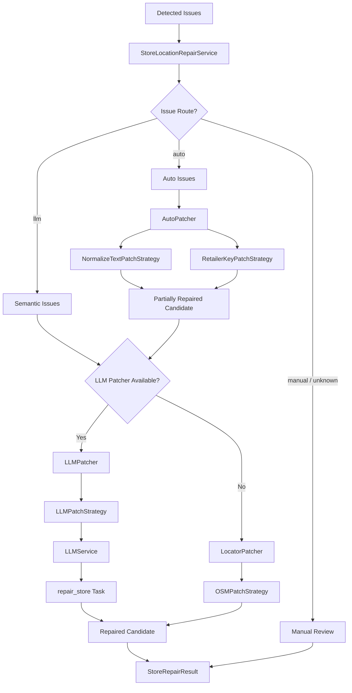
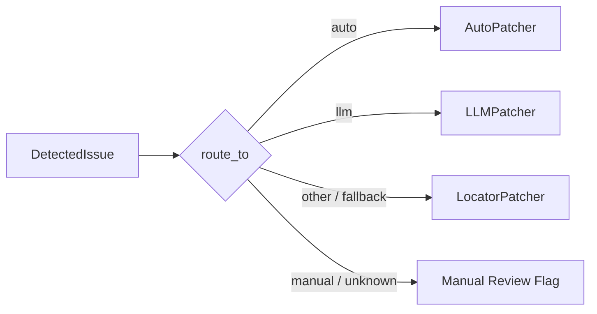
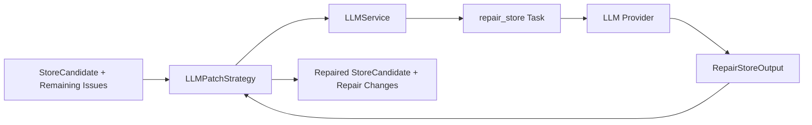
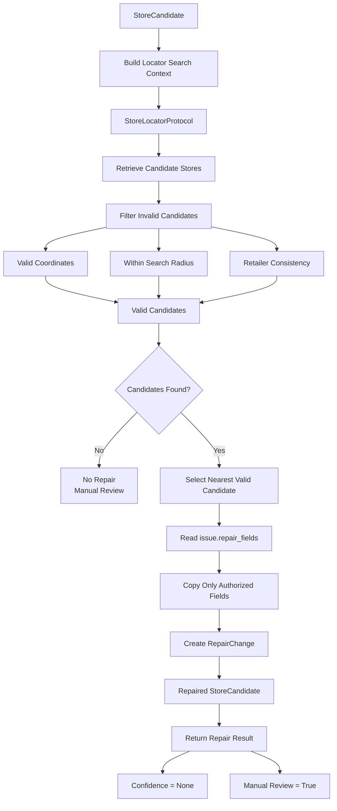
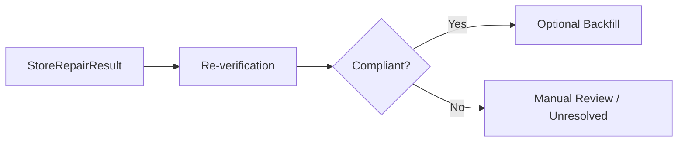

# Store Location Repair (Demo)

The Store Location Repair capability applies targeted repairs to `StoreCandidate` objects based on issues produced by Store Location Verification.

Repair is intentionally separated from verification: Verification determines what is wrong; Repair determines how supported issues can be fixed.

This capability only performs repair. Re-verification, correction-level orchestration, and backfill are handled outside the repair service.

## Structure

| Component | Description |
|---|---|
| `store_location_repair_service.py` | Main repair service. Routes issues and coordinates auto, LLM, and locator-backed repair. |
| `models.py` | Repair-specific result model. |
| `protocols.py` | Contracts for repair strategies and the repair service. |
| `patchers/auto_patcher.py` | Routes deterministic issues to auto patch strategies. |
| `patchers/llm_patcher.py` | Thin adapter for semantic LLM repair. |
| `patchers/locator_patcher.py` | Thin adapter for locator-backed repair. |
| `patchers/patch_strategies/auto/` | Deterministic normalization strategies. |
| `patchers/patch_strategies/llm/` | LLM-backed semantic repair. |
| `patchers/patch_strategies/locator/` | External locator-backed repair. |

## Repair Flow



The repair service does not decide whether the repaired candidate is ultimately acceptable. The next workflow step is external re-verification.

## Service Interface

### `StoreLocationRepairService`

The main interface is:

```python
result = repair_service.repair(
    candidate,
    issues,
)
```

The service:

1. receives verification issues;
2. partitions issues according to `ISSUE_TYPES`;
3. applies deterministic auto repairs first;
4. routes remaining issues to LLM repair when configured;
5. otherwise uses locator repair as the conservative fallback;
6. returns the repaired candidate and repair diagnostics.

No repair work is performed when the issue list is empty.

## Issue Routing

Routing is driven by the shared `ISSUE_TYPES` definitions.



Current routing semantics are:

| Route | Meaning |
|---|---|
| `auto` | Deterministic repair can be applied without semantic inference. |
| `llm` | Repair requires semantic judgment and may use the LLM repair task. |
| `manual` / unknown | Repair cannot be safely automated and should remain subject to manual review. |
| no LLM available | Non-auto issues fall back to locator repair when a locator patcher is configured. |

Unknown issue types are routed conservatively and trigger manual review.

## Auto Repair

Auto repair is deterministic.

### `NormalizeTextPatchStrategy`

Handles:

- `case_variation`
- `punctuation_variation`
- `whitespace_variation`
- `abbreviation_variation`
- `direction_alias_variation`

It applies normalization to the fields specified by the issue and produces a `RepairChange` for each changed field.

### `RetailerKeyPatchStrategy`

Handles:

- `missing_retailer_key`
- `retailer_key_mismatch`

Retailer-key derivation is delegated to `StoreInfoNormalizationService`, keeping repair aligned with the normalization behavior used by Resolution and Verification.

## LLM Repair

`LLMPatchStrategy` performs semantic repair through the shared `LLMService`.



The Repair capability does not implement prompt rendering, provider execution, or model response parsing itself. Those responsibilities belong to `LLMService`.

The registered `repair_store` task receives:

```text
store_location
remaining_issues
```

and returns:

```text
repair_changes
repaired_store_location
overall_confidence
requires_manual_review
```

The strategy applies supported returned fields to a new `StoreCandidate`.

The LLM prompt also requires the repaired store location to remain internally consistent, preserve the input field shape, and avoid changing fields unrelated to the reported issues.

## Locator Repair

`OSMPatchStrategy` provides conservative external-evidence repair.



The strategy validates candidate coordinates, distance, and basic retailer identity before using an external candidate for repair.

Locator repair intentionally does not claim a repair confidence score and requires manual review when locator repair is attempted.

The locator implementation is injected, so the strategy remains independent of a specific acquisition mechanism.

## Repair Result

`StoreRepairResult` contains:

```text
original_candidate
repaired_candidate
repair_changes
repair_confidence
requires_manual_review
```

It also exposes:

```python
result.changed
result.change_count
```

`changed` indicates whether the repair produced a different candidate.

## Repair Confidence

Auto repairs are deterministic and do not reduce repair confidence.

When LLM repair is used, the service combines:

- per-change confidence;
- issue weights;
- the LLM-reported overall confidence.

The final score is conservative and cannot exceed the LLM-reported overall confidence.

The current manual-review threshold is:

```text
0.80
```

Locator repair keeps confidence unset and requires manual review.

## Capability Boundaries

Repair consumes issues from Verification:


Repair does not:

- verify the original candidate;
- decide whether the repaired candidate is fully compliant;
- write to `store_locations`;
- update `flyer_deals`;
- perform final backfill.

The downstream workflow is responsible for re-verification:



This keeps repair and verification as separate capabilities.

## Notes

- **Implementation status:** This capability is implemented but has not been fully integration-tested against the persistence layer.
- Due to the current `store_locations` writeback limitation, the complete repair → re-verification → backfill workflow cannot currently be validated end to end.
- The repair logic and individual repair strategies can still be exercised independently against in-memory `StoreCandidate` objects.
- `LLMPatchStrategy` uses the shared `LLMService` rather than implementing direct provider access.
- `OSMPatchStrategy` reuses a locator through `StoreLocatorProtocol` rather than embedding a separate store-acquisition implementation.
- Retailer-key repair uses `StoreInfoNormalizationService` rather than the deprecated standalone address-normalization dependency.
- The repair service returns a candidate and diagnostics; callers must perform any subsequent verification or persistence.
