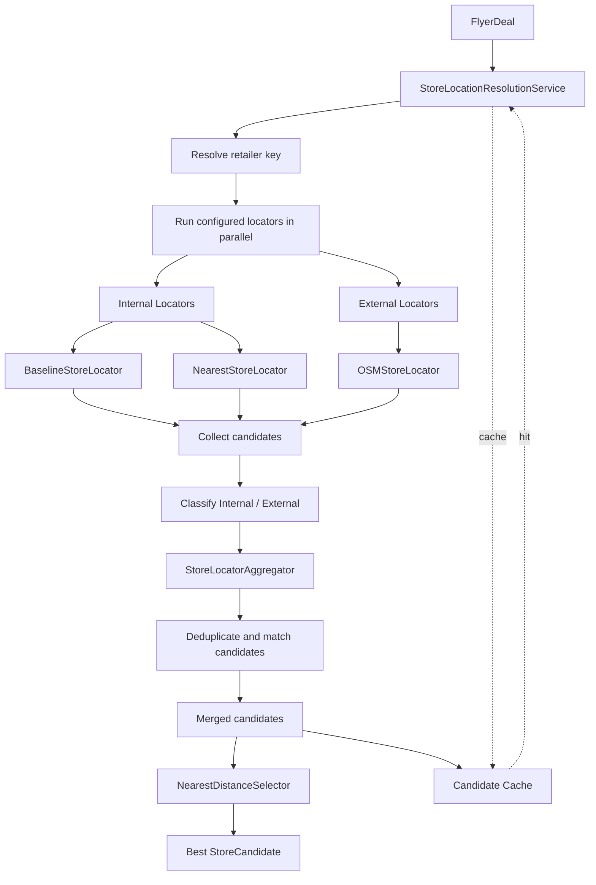

# Store Location Resolution

The Store Location Resolution capability resolves a flyer deal into one or more candidate store locations, combines candidates from internal and external locators, removes likely duplicates, and selects the best candidate by distance and locator-source preference.

This capability is the resolution layer of Store Service. It does not verify, repair, ingest, promote, or persist store-location changes.

## Structure

| Component | Description |
|---|---|
| `store_location_resolution_service.py` | Main resolution service. Coordinates locators, candidate aggregation, selection, retailer-key normalization, and candidate caching. |
| `protocols.py` | Capability-local protocols for store locators and candidate selectors. |
| `models.py` | Resolution-specific models for candidate buckets and locator aggregation results. |
| `store_locator_aggregator.py` | Deduplicates and merges internal/external candidates using multi-signal similarity scoring. |
| `selectors/nearest_distance_selector.py` | Selects the best candidate using distance and internal-source preference. |
| `locators/internal/baseline_store_locator.py` | Internal baseline lookup using retailer + ZIP, with city/state fallback. |
| `locators/internal/nearest_store_locator.py` | Internal nearest-store lookup backed by the PostGIS RPC. |
| `locators/external/osm_store_locator.py` | External OpenStreetMap / Nominatim candidate acquisition. |

## Resolution Flow



## Interfaces

### `StoreLocationResolutionService`

The main public interface is:

```python
service.find_candidate_stores(deal)
```

This returns the merged candidate list.

For asynchronous callers:

```python
await service.find_candidate_stores_async(deal)
```

To directly select the best candidate:

```python
best = service.find_best_store_candidate(deal)
```

and:

```python
best = await service.find_best_store_candidate_async(deal)
```

The service also exposes:

```python
service.clear_cache()
service.get_candidate_cache_stats()
```

### `StoreLocatorProtocol`

Each locator implements:

```python
async def find_candidate_stores(
    deal: FlyerDeal,
) -> list[StoreCandidate]:
    ...
```

Locators are treated uniformly by the resolution service regardless of whether they use internal database data or external search.

### `StoreCandidateSelectorProtocol`

The selector interface is:

```python
def select(
    candidates: Sequence[StoreCandidate],
) -> StoreCandidate | None:
    ...
```

## Locator Strategies

### Internal

| Locator | Strategy |
|---|---|
| `BaselineStoreLocator` | Looks up canonical stores by exact `retailer_key + ZIP`; falls back to `retailer_key + city/state`. Candidate distance is calculated from the deal context. |
| `NearestStoreLocator` | Resolves the deal context coordinates and calls the `find_nearest_store` PostGIS RPC within the configured radius. |

### External

| Locator | Strategy |
|---|---|
| `OSMStoreLocator` | Queries Nominatim with retailer/ZIP variants, filters results by retailer identity, converts valid results into external `StoreCandidate` objects, deduplicates them, and limits results by distance/count. |

## Candidate Aggregation

`StoreLocatorAggregator` separates the internal and external candidate sets before matching external candidates against internal candidates.

The current similarity score uses:

| Signal | Weight |
|---|---:|
| Address similarity | 0.35 |
| Store-name similarity | 0.20 |
| City match | 0.15 |
| State match | 0.15 |
| ZIP similarity | 0.10 |
| Geographic similarity | 0.05 |

The default similarity threshold is `0.82`.

An external candidate that matches an internal candidate at or above the threshold is treated as the same store and dropped in favor of the internal candidate. Unmatched external candidates remain in the merged result.

The aggregator also handles:

- internal candidate deduplication by canonical store ID;
- external candidate deduplication by locator/source identifiers and normalized store fields;
- direction aliases;
- street-suffix aliases;
- state aliases;
- ZIP5 comparison;
- geographic distance scoring.

The aggregation result records both the merged candidates and diagnostics such as matched pairs, similarity scores, and dropped external candidates.

## Candidate Selection

`NearestDistanceSelector` ranks candidates primarily by distance.

When both internal and external candidates are available, an internal candidate is preferred when its distance is within the configured `internal_prefer_threshold_meters` of the nearest external candidate.

The default threshold is:

```text
50 meters
```

Otherwise, candidates are ranked by:

```text
distance
→ locator source priority
→ canonical store ID
```

Internal candidates have higher source priority than external candidates.

## Retailer Normalization

Resolution uses the shared `StoreInfoNormalizationService` for retailer-key normalization rather than maintaining a separate normalization implementation.

The resolution-specific lookup flow is:

```text
persisted retailer_key
        ↓
StoreInfoNormalizationService.normalize_retailer_key()
        ↓
StoreInfoNormalizationService.make_retailer_key()
```

This preserves the legacy retailer-key behavior required by existing locator lookups while keeping normalization ownership inside the Store Info Normalization capability.

## Caching

Resolved candidate lists are cached using the retailer key and deal location context.

The cache key includes:

- retailer key;
- ZIP code;
- city;
- state;
- retailer address;
- store latitude;
- store longitude.

Cached candidate lists are copied before being returned so callers cannot mutate the stored cache value directly.

## Notes

- This capability only resolves store candidates. It does not perform verification, correction, repair, ingestion, promotion, or database writeback.
- Internal and external locators may fail independently. A failed locator is logged and does not prevent the remaining locators from contributing candidates.
- `BaselineStoreLocator` and `NearestStoreLocator` depend on the current canonical store lookup infrastructure and `store_locations` data.
- `OSMStoreLocator` depends on Nominatim availability and its configured request rate limit. External results are therefore less deterministic than internal candidates.
- The aggregator intentionally prefers an internal candidate when an external candidate is sufficiently similar to it.
- Retailer-key normalization should remain compatible with the existing canonical store lookup keys. The resolution capability delegates this responsibility to `StoreInfoNormalizationService`.
- The current implementation retains the existing locator and aggregation behavior while moving the orchestration logic out of the Store Service umbrella facade.
- `StoreService` should remain an umbrella facade; resolution-specific orchestration belongs here rather than in the generic service layer.
