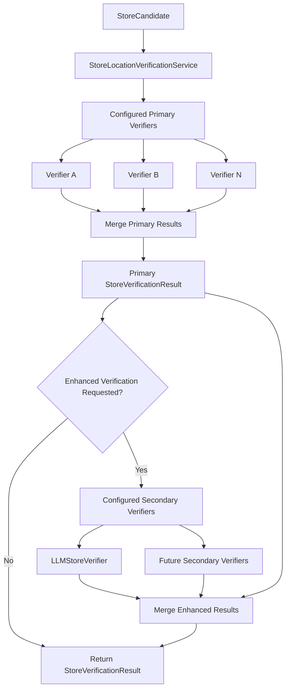
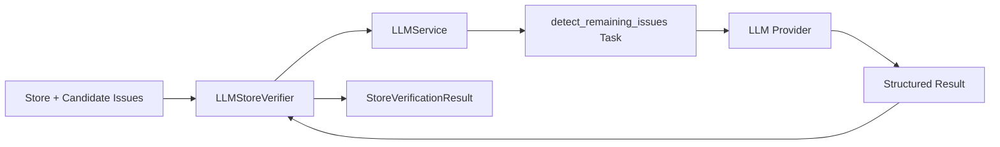
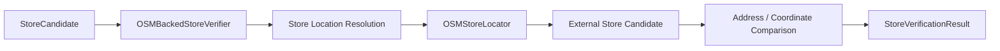
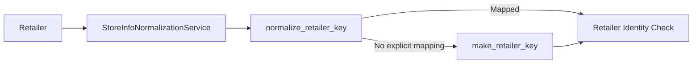
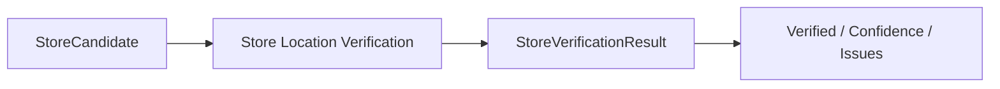
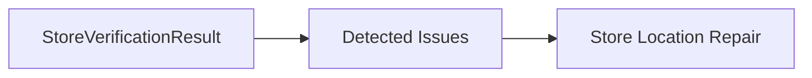

# Store Location Verification

The Store Location Verification capability evaluates a `StoreCandidate` and returns a `StoreVerificationResult` containing the verification decision, confidence score, and detected issues.

Verification is composition-based. A primary verifier set is required, but the concrete verifier combination is configurable. Optional secondary verifiers can be assembled when broader or more expensive verification is needed, such as LLM-backed issue detection.

This capability only detects and reports issues. It does not repair, mutate, backfill, or persist store data.

## Structure

| Component | Description |
|---|---|
| `store_location_verification_service.py` | Main verification service. Executes configured primary verifiers and optional secondary enhancements, then merges their results. |
| `models.py` | Verification-specific result models. |
| `protocols.py` | Contracts for primary and optional secondary verifiers. |
| `verification_helper.py` | Shared utilities for coordinate, text, confidence, result, and issue handling. |
| `verifiers/primary/basic_verifiers/` | Field-completeness and coordinate-sanity verifiers. |
| `verifiers/primary/cross_field_verifiers/` | Cross-field consistency verification. |
| `verifiers/primary/identity_verifiers/` | Retailer and store-identity verification. |
| `verifiers/primary/osm_verifiers/` | External-evidence verification using the Resolution capability's OSM locator. |
| `verifiers/secondary/` | Optional enhanced verification such as LLM-backed issue detection. |

## Verification Flow



Primary verification is required, but the service does not prescribe a fixed primary verifier set. The concrete composition is supplied when the service is assembled.

Secondary verification is optional and acts as an enhancement layer rather than a mandatory workflow stage.

## Service Interfaces

### `verify()`

Runs the configured primary verifier set:

```python
result = verification_service.verify(store)
```

This is the default verification interface.

### `verify_primary()`

Explicitly runs all configured primary verifiers:

```python
result = verification_service.verify_primary(store)
```

Primary results are combined using:

```text
verified   = all configured verifier results are verified
confidence = minimum verifier confidence
issues     = merged unique issues
```

### `verify_secondary()`

Runs the configured secondary verifiers using the candidate and detected issues as additional context:

```python
result = verification_service.verify_secondary(
    store,
    candidate_issues,
)
```

Secondary verification is optional enhanced detection. It does not imply that repair has occurred and does not modify the candidate.

### `verify_enhanced()`

Runs primary verification and applies configured secondary verifiers when available:

```python
result = verification_service.verify_enhanced(store)
```

This provides a convenient combined interface while preserving configurable verifier composition.

## Verifier Composition

The concrete verifier set is assembled externally.

A minimal test configuration can use only one primary verifier:

```python
verification_service = StoreLocationVerificationService(
    primary_verifiers=[
        CoordinateSanityVerifier(),
    ],
)
```

A broader configuration can combine multiple independent signals:

```python
verification_service = StoreLocationVerificationService(
    primary_verifiers=[
        FieldCompletenessVerifier(),
        CoordinateSanityVerifier(),
        IdentityVerifier(),
        CrossFieldConsistencyVerifier(
            geocoder=geocoder,
        ),
        OSMBackedStoreVerifier(
            locator=osm_locator,
        ),
    ],
    secondary_verifiers=[
        LLMStoreVerifier(
            llm_service=llm_service,
            model=model,
        ),
    ],
)
```

This allows different verifier combinations to be evaluated in production, experiments, and isolated tests without changing `StoreLocationVerificationService`.

## Primary Verifiers

| Verifier | Purpose |
|---|---|
| `FieldCompletenessVerifier` | Detects missing address, full address, city, state, retailer-specific store ID, and retailer key. |
| `CoordinateSanityVerifier` | Detects missing, invalid, zero, or non-US coordinates. |
| `CrossFieldConsistencyVerifier` | Checks consistency among address, city/state, ZIP, and coordinates; geocoding can optionally provide additional evidence. |
| `IdentityVerifier` | Checks retailer-key and store-identity consistency. |
| `OSMBackedStoreVerifier` | Uses external OSM evidence to compare address and coordinate information. |

These are available primary verifier implementations rather than a mandatory fixed set.

## Optional Secondary Verification

Secondary verifiers provide additional verification coverage when deeper or more expensive analysis is useful.

The current implementation is:

| Verifier | Purpose |
|---|---|
| `LLMStoreVerifier` | Uses LLM-backed contextual reasoning to evaluate candidate issues more broadly. |

`LLMStoreVerifier` delegates model execution to the shared `LLMService`:



The verifier does not directly manage model providers, prompt rendering, or response parsing. Those responsibilities belong to `LLMService`.

LLM-backed verification remains detection only. It does not repair or mutate the `StoreCandidate`.

## OSM-Backed Verification

`OSMBackedStoreVerifier` reuses the external locator owned by Store Location Resolution.



The verifier intentionally builds the OSM lookup without using the candidate's existing coordinates as the search origin. This avoids using potentially incorrect coordinates as evidence for validating those same coordinates.

Verification can succeed through either sufficiently close coordinates or sufficient address similarity.

Current defaults are:

```text
max_coordinate_delta_meters = 300
min_address_similarity = 0.70
```

## Identity Verification

`IdentityVerifier` delegates retailer-key normalization to `StoreInfoNormalizationService`.



This keeps retailer identity verification aligned with the retailer-key behavior used by Store Location Resolution.

## Protocols

Primary verifiers implement `StoreVerifierProtocol`:

```python
def verify(
    store: StoreCandidate,
) -> StoreVerificationResult:
    ...
```

Optional secondary verifiers currently implement `SecondaryStoreVerifierProtocol`:

```python
def verify(
    request: DetectRemainingIssuesInput,
) -> StoreVerificationResult:
    ...
```

The contracts remain separate because the current LLM-backed verifier requires both store context and candidate issues.

## Verification Helpers

`verification_helper.py` contains reusable verification utilities rather than workflow orchestration.

Current helpers support:

- numeric conversion;
- coordinate validation;
- Haversine distance calculation;
- normalized text and address comparison;
- address similarity;
- token-overlap scoring;
- deterministic confidence calculation;
- verification-result construction;
- issue merging;
- synchronous execution of async locator calls where required.

Keeping these helpers separate allows individual verifiers to reuse them without coupling verifier logic to the service implementation.

## Capability Boundary

The output boundary of this capability is `StoreVerificationResult`.



If issues are detected, Verification returns them to the caller. It does not decide how those issues should be repaired.

A downstream Store Location Repair capability may consume the detected issues:



Verification itself does not invoke Repair.

## Notes

- **Implementation status:** The verification capability is implemented, but the complete verification → repair → persistence workflow has not been fully integration-tested.
- At least one primary verifier must be configured, but the concrete primary verifier set is fully configurable.
- Primary verifier composition can be changed for production, experiments, or isolated testing without modifying `StoreLocationVerificationService`.
- Secondary verifiers are optional enhancements and can be assembled when broader or more expensive verification is required.
- `LLMStoreVerifier` provides optional LLM-backed enhanced verification through the shared `LLMService`; it does not perform repair or mutate the candidate.
- `OSMBackedStoreVerifier` depends on external OSM/Nominatim availability through Store Location Resolution and may therefore be less deterministic than local verification strategies.
- `StoreVerificationResult` is owned by this capability, while `StoreCandidate` and `DetectedIssue` remain shared Store Service domain models.
- Verification returns detected issues to the caller. Store Location Repair, subsequent re-verification orchestration, backfill, and persistence are outside this capability.
